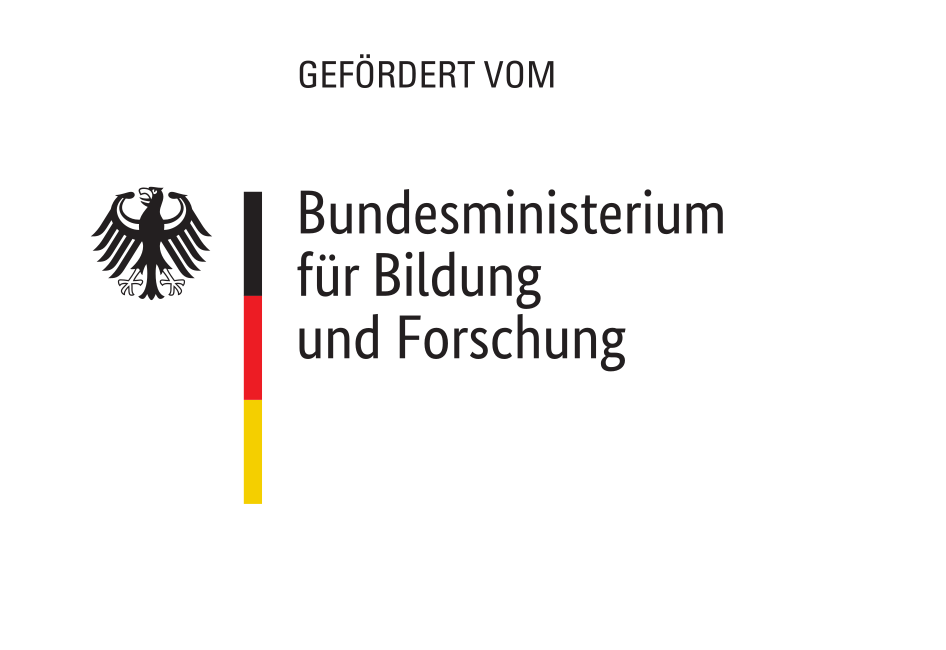
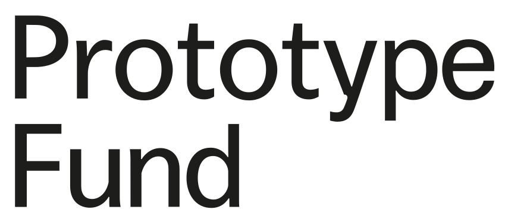

 

  

  <h1 align="center">Open Public Transport (Data)</h1>

  

    Data for <a href="https://github.com/fom-big-data-bike-path-quality/fom-big-data-bike-path-quality-analytics" target="_blank">Open
     Public Transport analytics</a> 
  

## About The Project

tbd

### Built With

* tbd

## Installation

tbd

## Structure

  

## Usage

tbd

## Roadmap

See the [open issues](https://github.com/open-public-transport/open-public-transport-data/issues) for a list of proposed features (and
 known issues).

## Contributing

Follow our [contribution guidelines](./CONTRIBUTING.md).

## Funding

Between September 2021 through February 2022 this project is founded by [German Federal Ministry of Education and Research](https://www.bmbf.de/bmbf/en/home/home_node.html) and supported by [Prototype Fund](https://prototypefund.de/).

  
  

## License

tbd

## Contact

kontakt@openpublictransport.de
